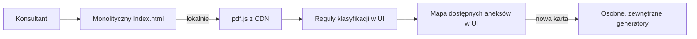
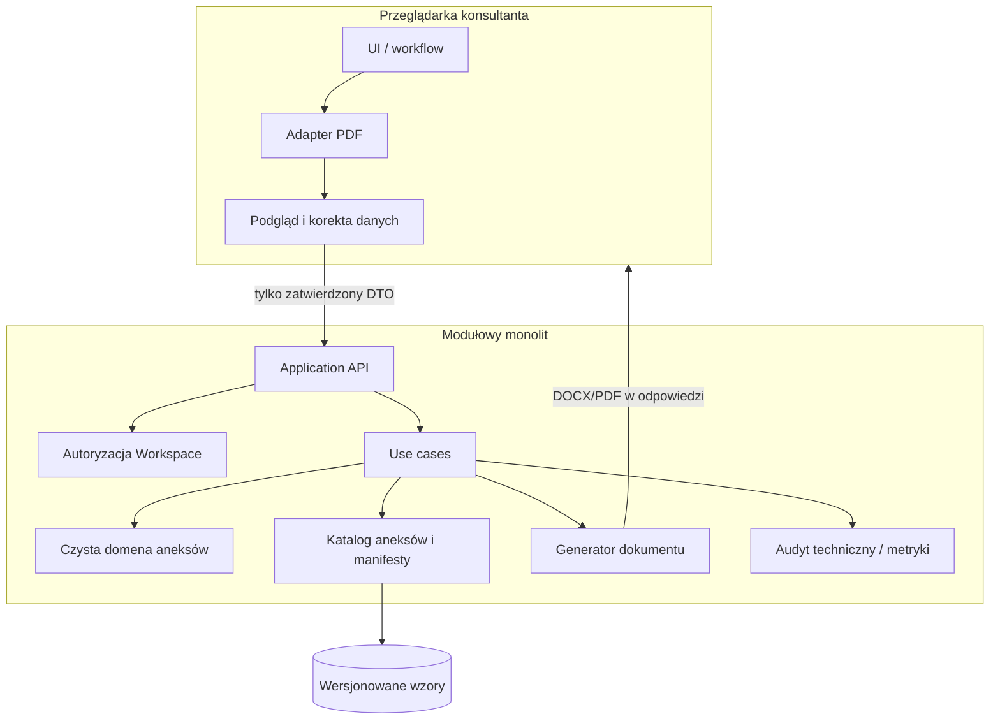

# Docelowa architektura generatora aneksów Tutlo

## 1. Cel i założenia

Dokument opisuje kierunek techniczny dla aplikacji używanej przez 8–10 konsultantów
jednocześnie. Nie zmienia zasad opisanych w `LOGIKA_ANEKSOW.md`; proponuje jedynie
granice modułów, przepływ danych, sposób wdrażania i etapy bezpiecznej refaktoryzacji.

Założenia:

- konsultant wczytuje umowę PDF, wybiera aneks, uzupełnia dane i pobiera dokument;
- dane umów zawierają dane osobowe, dlatego przetwarzanie w przeglądarce jest
  preferowane, a trwałe przechowywanie wymaga osobnej decyzji biznesowej i prawnej;
- źródłem prawdy dla reguł pozostaje zaakceptowana, wersjonowana logika domenowa;
- obciążenie jest małe, lecz generowanie musi być odporne na równoległe żądania;
- pierwszym środowiskiem może pozostać Google Apps Script, bez budowy mikroserwisów.

## 2. Stan obecny

### 2.1. Inwentaryzacja

Repozytorium jest obecnie **routerem/prototypem interfejsu**, a nie kompletnym
generatorem:

| Element | Odpowiedzialność | Ocena |
|---|---|---|
| `index.html` | Samodzielny podgląd UI, lokalny odczyt PDF, klasyfikacja i routing | Cała warstwa prezentacji i logika klasyfikacji w jednym pliku |
| `apps-scirpt/Index.html` | Kopia UI dla Apps Script z wstrzyknięciem adresów | Niemal pełny duplikat `index.html`; katalog ma literówkę w nazwie |
| `apps-scirpt/Code.gs` | `doGet()` i mapa adresów zewnętrznych generatorów | Brak API generowania, walidacji, autoryzacji i obsługi błędów |
| wzory DOCX (pierwotnie `templates/*.docx`) | Pięć binarnych wzorów z placeholderami | W stanie wyjściowym brakowało manifestu pól, wersji wzoru i automatycznej kontroli placeholderów |
| `docs/LOGIKA_ANEKSOW.md` | Skrót reguł aneksów 11, 25, 26, 29 i 29a | Przydatny początek, lecz bez formalnych wejść, wyników i przypadków brzegowych |
| `router.js` | Pusty plik | Nie pełni żadnej roli |

Aktualny przepływ wygląda następująco:



### 2.2. Mocne strony

- Tekst PDF jest odczytywany lokalnie, więc surowa umowa nie jest obecnie wysyłana
  do AI ani do serwera aplikacji.
- Istnieje podział wzorów DOCX według rodzaju aneksu.
- Klasyfikacja podaje użytkownikowi przesłanki i poziom pewności oraz udostępnia
  ręczny wybór jako ścieżkę awaryjną.
- Apps Script pozwala tanio obsłużyć zakładaną liczbę użytkowników i pasuje do
  firmowego środowiska Google Workspace.

### 2.3. Najważniejsze problemy i ryzyka

1. **Brak jednego systemu.** Router tylko otwiera adresy innych wdrożeń, a kod
   właściwych generatorów nie znajduje się w repozytorium. Nie da się prześledzić
   całego procesu ani zagwarantować spójności wersji.
2. **Brak separacji odpowiedzialności.** HTML zawiera style, widoki, integrację z
   PDF.js, klasyfikację, katalog aneksów i nawigację. Reguł nie można testować bez
   uruchamiania interfejsu.
3. **Duplikacja.** Dwie wersje `Index.html` różnią się tylko znacznikiem `<base>` i
   źródłem konfiguracji. Każda zmiana wymaga ręcznej synchronizacji.
4. **Rozproszone źródła prawdy.** Dostępność aneksów jest zaszyta w `ANNEX_RULES`,
   adresy w `GENERATOR_URLS`, reguły w dokumencie, a pola wewnątrz plików DOCX.
5. **Brak kontraktów danych.** Nie ma schematów wejścia/wyjścia, jawnego modelu rat,
   walidacji PESEL/NIP, kwot i dat ani standardu błędów.
6. **Brak testów i narzędzi projektu.** Repozytorium nie ma test runnera, lintingu,
   formatowania, pipeline'u CI ani kontrolowanego procesu budowania artefaktu.
7. **Ryzyko zależności runtime.** PDF.js jest pobierany z publicznego CDN przy każdym
   uruchomieniu. Awaria, blokada sieci lub niekontrolowana zmiana artefaktu zatrzyma
   pracę konsultantów.
8. **Bezpieczeństwo wdrożenia.** `ALLOWALL` zezwala na osadzanie aplikacji w iframe,
   a sam kod nie dokumentuje modelu dostępu. Nie ma też polityki retencji, audytu
   bez danych osobowych ani ochrony przed wielokrotnym wysłaniem żądania.
9. **Brak obserwowalności.** Nie wiadomo, ile generacji kończy się błędem, który wzór
   był użyty ani jak długo trwa operacja. Logowanie pełnych danych klienta byłoby
   dodatkowym ryzykiem.
10. **Niepełny zakres.** UI pokazuje także aneksy 9, 27, 28, 45 i 48, dla których w
    repozytorium nie ma wzorów ani opisanej logiki. Funkcja weryfikacji jest atrapą.
11. **Ryzyka wzorów.** Nazewnictwo placeholderów nie jest ujednolicone (m.in. znaki
    diakrytyczne i myślniki), a binarne DOCX nie podlegają sensownemu code review.
12. **Niespójność dokumentacji.** README wskazuje `apps-script/`, podczas gdy katalog
    w repozytorium nazywa się `apps-scirpt/`.

## 3. Rekomendacja: modułowy monolit

Dla 8–10 jednoczesnych użytkowników mikroserwisy, broker wiadomości i osobna baza
danych byłyby nieuzasadnionym kosztem. Rekomendowany jest **modułowy monolit** z
czystym rdzeniem domenowym, jedną aplikacją webową i jednym kontrolowanym procesem
generowania. Granice modułów mają umożliwić późniejszą wymianę Apps Script bez
przepisywania reguł.



### 3.1. Warstwy i zależności

Zależności zawsze biegną do środka: `presentation -> application -> domain`.
Adaptery infrastrukturalne implementują porty zdefiniowane przez aplikację.

#### `domain`

Czysty TypeScript/JavaScript bez DOM, `google.script.run`, PDF.js i usług Google:

- typy `Contract`, `Customer`, `PaymentSchedule`, `Installment`, `AnnexRequest`;
- identyfikatory aneksów jako stabilne wartości (`11`, `25`, `26`, `29`, `29a`);
- kalkulatory dat, kwot i harmonogramów;
- reguły kwalifikacji i walidacja niezmienników;
- wynik jako jawne `ValidationResult`, bez `alert()` i bez wyjątków technicznych.

Każdy rodzaj aneksu powinien implementować ten sam kontrakt, np.:

```ts
interface AnnexPolicy<Input, Output> {
  validate(input: Input): ValidationIssue[];
  calculate(input: Input): Output;
}
```

W pierwszych etapach istniejącą logikę należy jedynie przepisać do tego kontraktu i
zabezpieczyć testami charakteryzacyjnymi — bez poprawiania zachowania „przy okazji”.

#### `application`

Przypadki użycia koordynujące domenę i adaptery:

- `classifyContract`;
- `getAvailableAnnexes`;
- `prepareAnnex` (walidacja i wyliczenia);
- `generateAnnex` (wybór wersji wzoru i renderowanie);
- w przyszłości osobny `verifyAnnex`.

Warstwa zwraca stabilne kody błędów i `correlationId`. Nie zna przycisków UI ani
szczegółów Apps Script.

#### `infrastructure`

- adapter ekstrakcji tekstu z PDF (domyślnie w przeglądarce);
- adapter renderowania DOCX;
- repozytorium wersjonowanych wzorów i ich manifestów;
- konfiguracja środowiska;
- minimalny audyt i metryki bez PESEL, nazwiska, adresu, tekstu umowy i dokumentu.

#### `presentation`

Mały kontroler workflow oraz komponenty: wczytanie, wynik klasyfikacji, formularz,
podgląd danych, potwierdzenie i pobranie. UI nie oblicza nowych harmonogramów i nie
decyduje o kwalifikacji aneksu; tylko prezentuje wynik domeny.

### 3.2. Katalog aneksów jako jedno źródło prawdy

Każdy aneks powinien mieć manifest możliwy do walidacji w CI:

```json
{
  "id": "29a",
  "label": "Obniżenie o 2 raty",
  "policy": "two-free-installments",
  "template": "aneks-29a-dwie-raty-gratis.docx",
  "templateVersion": "1.0.0",
  "allowedContractVariants": ["flexible/internal"],
  "requiredFields": ["NUMER_UMOWY", "DATA_ANEKSU", "NOWA_CENA"],
  "enabled": true
}
```

Z manifestów powinny być generowane: lista w UI, walidacja wejścia, wybór polityki,
wybór wzoru i kontrola placeholderów. Aneks bez polityki lub wzoru nie może wyglądać
jak aktywny — może mieć jawny status `planned`.

### 3.3. Kontrakty na granicach

Minimalny kontrakt żądania generacji:

```ts
type GenerateAnnexRequest = {
  requestId: string;          // UUID tworzony w przeglądarce
  annexId: string;
  contract: ContractDto;      // tylko pola potrzebne dla wybranego aneksu
  inputs: Record<string, unknown>;
  expectedTemplateVersion: string;
};
```

Odpowiedź zawiera `requestId`, `correlationId`, nazwę pliku, MIME type, wersję wzoru
i plik albo krótkotrwały identyfikator pobrania. Ten sam `requestId` powinien dawać
ten sam rezultat lub informację o zakończonej operacji, co chroni przed podwójnym
kliknięciem.

## 4. Przepływ danych i prywatność

1. PDF jest wczytywany i parsowany lokalnie.
2. Klasyfikator zwraca wynik wraz z dopasowanymi sygnałami; niska pewność wymusza
   świadome potwierdzenie wariantu przez konsultanta.
3. Parser buduje ustrukturyzowany model, a UI pokazuje wszystkie pola używane do
   generacji. Konsultant koryguje i zatwierdza dane.
4. Do generatora trafiają tylko zatwierdzone pola wymagane przez manifest aneksu,
   nie surowy PDF i nie pełny wyekstrahowany tekst.
5. Dokument jest generowany w pamięci i zwracany do pobrania. Domyślna retencja po
   stronie serwera wynosi zero; jeżeli ograniczenia Apps Script wymuszą plik
   tymczasowy, musi on mieć automatyczne usunięcie i udokumentowany czas życia.
6. Log techniczny zawiera wyłącznie: czas, skrócony identyfikator użytkownika lub
   pseudonim, `annexId`, wersję wzoru, wynik, czas trwania i `correlationId`.

Przed produkcją właściciel danych powinien zatwierdzić zakres danych, retencję,
uprawnienia administratorów, lokalizację przetwarzania i procedurę incydentową.

## 5. Współbieżność dla 8–10 konsultantów

Zakładana skala nie wymaga kolejek. Wymaga natomiast bezstanowego żądania:

- żadnych danych bieżącej umowy w zmiennych globalnych Apps Script;
- żadnego wspólnego „roboczego” DOCX/Google Doc nadpisywanego przez użytkowników;
- osobny bufor lub plik tymczasowy na `requestId`;
- blokada tylko dla bardzo krótkiej sekcji tworzenia wpisu idempotencji, nigdy dla
  parsowania, obliczeń lub całej generacji;
- ograniczony rozmiar wejścia i timeout po stronie UI;
- przycisk generowania blokowany podczas żądania, ale bezpieczeństwo zapewnia także
  `requestId` po stronie serwera;
- test obciążeniowy co najmniej 10 równoległych generacji, w tym tego samego typu
  aneksu, potwierdzający brak mieszania danych;
- jawny komunikat o wyczerpaniu limitu usługi oraz bezpieczna możliwość ponowienia.

Przed wyborem Apps Script na produkcję trzeba zmierzyć czas i rozmiar rzeczywistego
renderowania oraz sprawdzić limity konta firmowego. Dopiero przekroczenie limitów lub
wymaganie zaawansowanej integracji uzasadnia przeniesienie cienkiego API np. do
Cloud Run. Rdzeń domenowy i manifesty pozostają wtedy bez zmian.

## 6. Bezpieczeństwo i niezawodność

Minimalna lista warunków produkcyjnych:

- wdrożenie dostępne wyłącznie dla właściwej domeny/grupy Google Workspace;
- rezygnacja z `ALLOWALL`, chyba że istnieje zatwierdzony przypadek osadzania; wtedy
  wymagane są restrykcje origin i ochrona przed clickjackingiem na warstwie hosta;
- zależności przypięte i dostarczane z kontrolowanego artefaktu, bez zależności od
  publicznego CDN w czasie pracy;
- limity rozmiaru i typu pliku oraz walidacja rzeczywistej sygnatury PDF;
- ponowna walidacja wszystkich danych po stronie wykonującej generację;
- escapowanie wartości wstawianych do dokumentu i neutralne nazwy pobieranych plików;
- brak sekretów i adresów środowiskowych w kodzie; konfiguracja oddzielona dla
  development/staging/production;
- kontrolowany dostęp do wzorów, checksumy i historia zatwierdzeń prawnych;
- komunikaty dla użytkownika bez stack trace i logi diagnostyczne bez PII;
- procedura wycofania wdrożenia i poprzednia wersja wzoru gotowa do przywrócenia.

## 7. Proponowana struktura repozytorium

Docelowo, niezależnie od użytego bundlera:

```text
/
├── src/
│   ├── domain/
│   │   ├── contracts/
│   │   ├── annexes/{11,25,26,29,29a}/
│   │   ├── classification/
│   │   └── shared/{dates,money,validation}/
│   ├── application/
│   │   ├── ports/
│   │   └── use-cases/
│   ├── infrastructure/
│   │   ├── apps-script/
│   │   ├── docx/
│   │   ├── pdf/
│   │   └── observability/
│   └── presentation/
│       ├── components/
│       └── workflows/
├── annexes/
│   └── manifests/*.json
├── templates/
│   ├── source/
│   └── manifests/
├── tests/
│   ├── unit/
│   ├── contract/
│   ├── integration/
│   ├── fixtures/synthetic/
│   └── e2e/
├── scripts/
├── docs/
└── dist/                 # generowane, nieedytowane ręcznie
```

Jeden build powinien tworzyć zarówno wersję Apps Script, jak i opcjonalny statyczny
podgląd. Źródłowy HTML i logika istnieją tylko raz; konfiguracja jest podawana przez
adapter środowiska.

## 8. Strategia testów

### Testy jednostkowe

- normalizacja i klasyfikacja tekstu na syntetycznych fragmentach umów;
- arytmetyka pieniężna w groszach, bez zmiennoprzecinkowych zaokrągleń;
- granice miesięcy, lat przestępnych i przesunięcia harmonogramu;
- wymaganie jednej/dwóch przyszłych rat dla 29/29a;
- macierz kwalifikacji typu umowy, płatności i aneksu.

### Testy kontraktowe i wzorów

- każdy manifest wskazuje istniejącą politykę i wzór;
- placeholdery w DOCX odpowiadają polom deklarowanym w manifeście;
- po renderowaniu nie pozostaje żaden `{{PLACEHOLDER}}`;
- wzór ma checksumę i zatwierdzoną wersję;
- snapshot tekstowej reprezentacji wygenerowanego dokumentu wykrywa niezamierzone
  zmiany treści prawnej.

### Integracja i E2E

- syntetyczny PDF -> klasyfikacja -> korekta -> generacja -> pobranie;
- błędny, pusty, zaszyfrowany i skanowany PDF;
- ręczny wybór po nierozpoznanej umowie;
- dziesięć równoległych generacji z unikalnymi znacznikami danych;
- retry tego samego `requestId`;
- kontrola, że logi i artefakty tymczasowe nie zawierają danych testowej osoby.

Do repozytorium nie wolno dodawać rzeczywistych umów. Fixture'y muszą być w pełni
syntetyczne i automatycznie sprawdzane pod kątem wzorców PESEL/NIP/adresów e-mail.

## 9. Obserwowalność i utrzymanie

Proponowane metryki:

- liczba rozpoczętych i zakończonych generacji według `annexId` i wersji wzoru;
- odsetek klasyfikacji niskiej pewności i ręcznych korekt;
- czas ekstrakcji, walidacji i generacji (percentyle p50/p95);
- błędy według stabilnego kodu, bez treści dokumentu;
- liczba retry i konfliktów idempotencji.

Alert ma dotyczyć gwałtownego wzrostu błędów lub braku możliwości generacji, nie
pojedynczego błędu użytkownika. Runbook powinien wskazywać właściciela, sposób
wycofania wersji, przełączenie wzoru oraz bezpieczny kanał zgłoszenia z
`correlationId` zamiast przesyłania umowy.

## 10. Etapy refaktoryzacji

### Etap 0 — inwentaryzacja i zamrożenie zachowania

1. Zebrać kod wszystkich zewnętrznych generatorów wskazywanych przez
   `GENERATOR_URLS`; bez tego repozytorium nie opisuje całego produktu.
2. Uzgodnić właścicieli biznesowych/prawnych oraz status każdego aneksu.
3. Spisać wejścia, wyniki i przykłady graniczne dla każdej istniejącej reguły.
4. Utworzyć wyłącznie syntetyczne fixture'y oraz testy charakteryzacyjne obecnego
   zachowania. Zanotować znane błędy, ale jeszcze ich nie poprawiać.
5. Zinwentaryzować placeholdery DOCX i ustalić checksumy wzorów bazowych.

**Kryterium wyjścia:** dla każdego aktywnego aneksu wiadomo, gdzie jest kod, wzór,
reguła, właściciel i zestaw przykładów akceptacyjnych.

### Etap 1 — fundament projektu bez zmiany funkcjonalnej

1. Dodać TypeScript, test runner, linting, formatowanie i CI.
2. Poprawić nazwę katalogu `apps-scirpt` i usunąć pusty `router.js` w osobnym,
   łatwym do przejrzenia commicie.
3. Z jednego źródła budować wariant statyczny i Apps Script.
4. Przenieść zależność PDF.js do przypiętego, kontrolowanego buildu.
5. Dodać walidację manifestów i placeholderów.

**Kryterium wyjścia:** powtarzalny build i testy odtwarzają dotychczasowe zachowanie
routera; nie ma ręcznie synchronizowanych kopii.

### Etap 2 — wydzielenie czystej domeny

1. Najpierw wydzielić normalizację, klasyfikację i katalog dostępności.
2. Następnie przenosić po jednym generatorze do wspólnego kontraktu polityki,
   zaczynając od najmniejszego (29), a potem 29a, 11, 25 i 26.
3. Liczyć pieniądze w groszach i wprowadzić jeden typ daty kalendarzowej.
4. Każdy ruch osłonić testami charakteryzacyjnymi; rozbieżność zachowania wymaga
   osobnej decyzji biznesowej, nie jest częścią refaktoryzacji.

**Kryterium wyjścia:** domenę można uruchomić i przetestować bez przeglądarki i Apps
Script, a stare i nowe wyniki są zgodne dla zaakceptowanego zestawu przypadków.

### Etap 3 — wspólny pipeline generowania

1. Wprowadzić manifesty, wspólny `GenerateAnnexRequest` i adapter DOCX.
2. Dodać ekran przeglądu/korekty danych przed generacją.
3. Zastąpić odsyłanie do wielu wdrożeń jednym przypadkiem użycia.
4. Dodać idempotencję, bezpieczne błędy, wersję wzoru w wyniku i zerową lub krótką,
   automatyczną retencję plików.
5. Migrować aneksy pojedynczo za flagami funkcjonalnymi z możliwością powrotu.

**Kryterium wyjścia:** pięć aneksów obecnych w repozytorium powstaje w jednym
kontrolowanym przepływie i przechodzi testy zgodności treści.

### Etap 4 — utwardzenie i pilotaż

1. Ograniczyć dostęp do grupy Workspace i zatwierdzić model prywatności.
2. Uruchomić test 10 równoległych konsultantów oraz scenariusze awarii.
3. Dodać metryki bez PII, dashboard, runbook i procedurę rollbacku.
4. Pilotaż z 2 konsultantami, potem 5, następnie 10; porównywać dokumenty z
   dotychczasowym procesem i rejestrować tylko kody rozbieżności.

**Kryterium wyjścia:** zaakceptowane testy prawne/biznesowe, brak mieszania danych,
zmierzony p95 i potwierdzona obsługa limitów platformy.

### Etap 5 — dalszy rozwój, poza refaktoryzacją

Dopiero po stabilizacji można dodać aneksy 9, 27, 28, 45 i 48, OCR dla skanów,
weryfikację gotowego aneksu lub integracje CRM. Każda z tych funkcji wymaga osobnego
zakresu, analizy danych i kryteriów akceptacji.

## 11. Kolejność priorytetów

| Priorytet | Działanie | Uzasadnienie |
|---|---|---|
| P0 | Pozyskać brakujący kod generatorów i potwierdzić wzory/reguły | Bez tego nie ma pełnej podstawy do migracji |
| P0 | Testy charakteryzacyjne i syntetyczne przypadki akceptacyjne | Chronią logikę przed niezamierzoną zmianą |
| P0 | Model dostępu i prywatności | Aplikacja przetwarza dane osobowe |
| P1 | Jeden build zamiast dwóch HTML-i, przypięte zależności i CI | Usuwa najpilniejszy dług utrzymaniowy |
| P1 | Czysta domena, manifesty i walidacja wzorów | Tworzy jedno źródło prawdy |
| P1 | Idempotentny, bezstanowy pipeline generowania | Zapewnia bezpieczną współbieżność |
| P2 | Metryki, runbook, pilotaż i test obciążenia | Umożliwia kontrolowane wdrożenie |
| P3 | OCR, weryfikacja i nowe typy aneksów | Nowe funkcje po ustabilizowaniu fundamentu |

## 12. Decyzje do podjęcia przed implementacją

1. Czy plik wynikowy ma być tylko DOCX, także PDF, czy oba formaty?
2. Czy dokument może być generowany całkowicie w przeglądarce, czy wymagany jest
   centralny audyt użytej wersji wzoru?
3. Czy jakikolwiek artefakt ma być przechowywany; jeśli tak — gdzie, jak długo i kto
   ma dostęp?
4. Które aneksy są rzeczywiście aktywne i jakie warianty umów obsługują?
5. Kto zatwierdza zmianę reguły oraz zmianę wzoru i czy wymagane są dwie akceptacje?
6. Czy Apps Script ma pozostać platformą produkcyjną po pomiarze, czy organizacja ma
   standard wymagający innego hostingu?
7. Jak ma wyglądać identyfikacja konsultanta i wymagany ślad audytowy?

Rekomendacja domyślna: pozostać przy Apps Script na pierwszy etap produkcyjny,
przetwarzać PDF lokalnie, nie przechowywać dokumentów, wdrożyć modułowy monolit i
podjąć decyzję o zmianie hostingu dopiero na podstawie pomiarów, a nie przewidywań.

## 13. Stan realizacji fundamentu P0

Pierwszy fundament został dodany bez podłączania go do działającego routera:

- aneksy 11, 25, 26, 29 i 29a mają niezależne katalogi zawierające manifest,
  generator planu renderowania, walidator, testy i własny, niezmieniony wzór DOCX;
- wspólny katalog modułów nie zawiera reguł obliczeniowych i nie zastępuje jeszcze
  istniejącej tablicy `ANNEX_RULES`;
- manifesty opisują stan zastany: warianty dostępności z interfejsu i dokładny zbiór
  placeholderów każdego wzoru;
- test kontraktowy odczytuje `word/document.xml` bez zewnętrznych zależności i
  potwierdza zgodność manifestu ze wzorem;
- generator na tym etapie wyłącznie waliduje kompletność i tworzy niemutowalny plan
  renderowania. Nie oblicza dat, kwot ani harmonogramów.

Takie odseparowanie pozwala w kolejnych krokach najpierw pozyskać brakujący kod
zewnętrznych generatorów, a następnie migrować każdy aneks niezależnie i porównywać
wyniki z zachowaniem referencyjnym.
