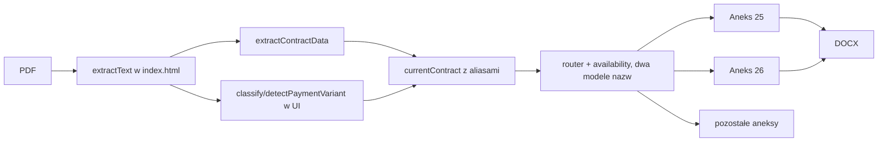
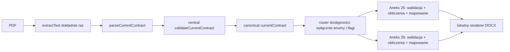

# Audyt parsera umów i przepływu danych do aneksów

## Zakres i stan zastany (Etap A)

Audyt objął `index.html`, `router.js`, `src/domain`, `src/application`, wszystkie katalogi
`src/annexes/*` oraz testy. Przed refaktorem przepływ miał postać:



### Miejsca analizujące tekst PDF / `rawText`

| Miejsce przed zmianą | Odpowiedzialność / problem |
|---|---|
| `index.html`: `extractText` | jedyne wydobycie warstwy tekstowej PDF (prawidłowo raz) |
| `index.html`: `normalize`, `classify`, `detectPaymentVariant` | klasyfikacja umowy i rat w UI, poza parserem domenowym; wariant był tekstem prezentacyjnym |
| `src/domain/contract-extraction.js` | wspólny ekstraktor danych, ale zwracał aliasy i diagnostykę razem z modelem |
| `router.js` | analizował `rawText` dla dostępności aneksu 43 i sprawdzał legacy `installmentCount` |
| `src/annexes/availability.js` | drugi router, oczekiwał `type/payment/variant` zamiast pól `currentContract` |

Aneksy 25 i 26 nie miały osobnych parserów całego tekstu, lecz aneks 26 miał własny
parser tekstowej wartości lektorów oraz własne normalizatory kwot. Pozostałości
`src/application/prepare-annex.js` oraz kalkulatory 29/29a używały starego `coursePrice`.
Aneks 43 korzystał ze wspólnych pól, ale router 43 sam czytał `rawText`. Nie znaleziono
importu ekstraktora jednego aneksu przez inny aneks. `src/annexes/26/legacy-plan.js`
importował wyłącznie wspólną fabrykę planu, nie parser.

### Inwentaryzacja regexów stanu zastanego

Wszystkie regexy standardowych danych znajdowały się w `src/domain/contract-extraction.js`,
z wyjątkiem klasyfikacji płatności w `index.html`:

| Dane | Wzorzec / kotwica |
|---|---|
| numer umowy | nagłówek `UMOWA ... nr ... EL/.../DD/MM/YYYY` |
| data umowy | końcowe `/DD/MM/YYYY` numeru umowy |
| klient | pola `IMIĘ I NAZWISKO:` albo `FIRMA:` ograniczone do `DANE NABYWCY` |
| PESEL | dokładnie 11 cyfr/spacji po etykiecie `PESEL` |
| NIP | dokładnie 10 cyfr/spacji/myślników po etykiecie `NIP` |
| adres | `ADRES:` do `telefon/e-mail/PESEL/NIP` |
| cena | pierwsza kwota po `Całkowita cena kursu wynosi` |
| liczba lekcji | `Liczba lekcji indywidualnych:` w `SPECYFIKACJA KURSU` |
| limit | dłuższa etykieta `Maksymalna miesięczna liczba...` |
| lektorzy | frazy `Lektor Polski`, `English Expert`, `Native Speaker` w `ZAWARTOŚĆ KURSU` |
| rachunek | `rachunek bankowy Tutlo: mBank S.A.` + 26 cyfr |
| terminy rat | kontekst `termin/płatność/rata` + `DD.MM.YYYY` |
| wariant rat | UI: `2 równe`, `kolejnych 23`, różna pierwsza rata, jednorazowa; brak jawnych 13 i 4 |

### Duplikacje, aliasy i walidacje

* Cena: `coursePrice`, `coursePriceCents`, wyliczane `monthlyInstallment` i lokalne
  `currentInstallmentCents`. Aneks 26 akceptował oba formaty i sam wybierał źródło.
* Tożsamość: wspólne `customerName`, lecz identyfikator firmy był wkładany do pola
  `pesel`; placeholder `PESEL` pozostaje jedynie nazwą historyczną szablonu DOCX.
* Lekcje: `monthlyLimit` kontra docelowe `monthlyLessonLimit`.
* Lektorzy: dowolny `teacherTypes` kontra docelowy enum `teacherVariant`.
* Harmonogram: `installments`, `installmentDueDates`, `courseStartDate` i
  `installmentCount` zamiast jednej struktury.
* Routing: `contractType/paymentType/paymentVariant` w jednym routerze, ale
  `type/payment/variant` i polski tekst `24 równe raty miesięczne` w drugim.
* Rachunki: `internalPaymentAccount` z umowy oraz `bankAccount` z formularza aneksu
  kredytowego są celowo różnymi danymi; nie należy ich scalać.
* Aneksy 25 i 26 powielały walidację numeru, daty, klienta, identyfikatora, ceny,
  lekcji, limitu i lektorów. Walidacja formularza banku aneksu 26 jest prawidłowo
  specyficzna dla aneksu.

## Architektura po refaktorze (Etapy B-D)



Parser jest jedynym właścicielem klasyfikacji, regexów i normalizacji. Router nie
interpretuje etykiet UI. Aneksy 25 i 26 nie czytają `rawText`; otrzymują ten sam DTO.

## Końcowy schemat `currentContract`

```js
{
  rawText: string,
  contractType: 'flexible' | 'limit',
  paymentType: 'credit' | 'internal',
  paymentVariant: 'credit' | 'internal_24' | 'internal_2' | 'internal_13' | 'internal_4',
  agreementNumber: string,
  agreementDate: 'YYYY-MM-DD',
  customerType: 'person' | 'company',
  customerName: string,
  personalId: string, // PESEL 11 albo NIP 10 cyfr
  address: string,
  coursePriceCents: number,
  lessonCount: number,
  monthlyLessonLimit: number,
  teacherVariant: 'polish_english_native' | 'english_native',
  internalPaymentAccount: string | null,
  installmentPlan: null | {
    paymentCount: 2 | 4 | 13 | 24,
    installments: Array<{number: number, dueDate: 'YYYY-MM-DD', amountCents: number | null}>,
    startDate: 'YYYY-MM-DD' | null,
    totalAmountCents: number
  }
}
```

### Macierz płatności

| Typ płatności | Wariant | Liczba płatności | Rachunek Tutlo |
|---|---:|---:|---|
| credit | `credit` | nie dotyczy modelu rat wewnętrznych | `null` |
| internal | `internal_24` | 24 | wymagany |
| internal | `internal_2` | 2 | wymagany |
| internal | `internal_13` | 13 (rok z góry + 12 miesięcznych) | wymagany |
| internal | `internal_4` | 4 | wymagany |

## Ekstraktory do usunięcia / odłączenia

Odłączono klasyfikator i detektor wariantu z `index.html`, aliasowe pola wspólnego
ekstraktora oraz tekstowy parser lektorów aneksu 26. Nie ma parsera aneksowego danych
standardowych do zachowania. Historyczne adaptery innych aneksów pozostają poza
zakresem migracji, zgodnie z kolejnością prac; nie wolno ich użyć jako źródła danych
przy tworzeniu następnego aneksu.
